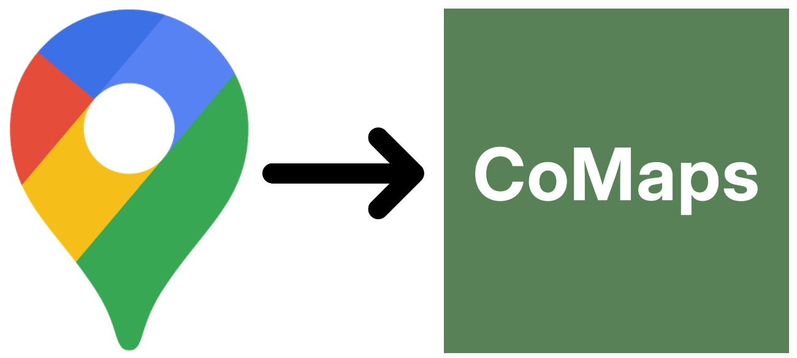

# Convert Google Maps saved places to CoMaps

This project allows you to convert the `Saved Places.json` file that you get from downloading data from the "Your data in Maps" screen in Google Maps. Both GPX and KMZ options are available.

The bookmark `name` will be set to the `name` property  if available, otherwise to the `address`, and if neither is available, to the GeoJSON coordinates.

Other metadata fields in the GeoJSON properties such as `address`, `date`, and `google_maps_url` are stored in the export `description` field, with labels bolded and line breaks.

> [!NOTE]
> For converting CSV saved places exports from Google Takeout, there is a [Python script](https://github.com/comaps/comaps/blob/main/tools/python/google_maps_bookmarks.py) available that will require you to generate a Google API key.

## URL

https://rudokemper.github.io/google-maps-places-to-comaps/

## Credits

This project uses the `tokml` library from [Mapbox](https://github.com/mapbox/tokml), and the `togpx` library from [tyrasd](https://github.com/tyrasd/togpx).

## History

This project began as a way to convert Google Maps saved places to [Organic Maps](https://organicmaps.app/). Since CoMaps is a fork of Organic Maps, it can still be used for that purpose. However, [due to governance concerns with Organic Maps](https://news.itsfoss.com/organic-maps-fork-comaps/), the project transitioned to explicitly supporting CoMaps instead.